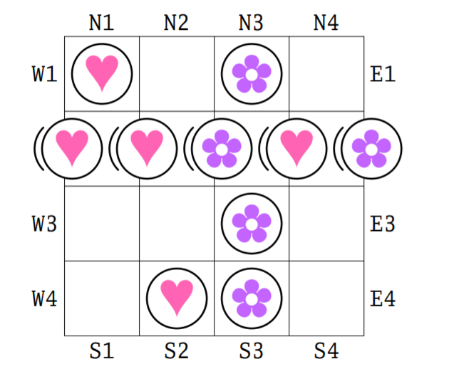

Hearts and flowers
------------------
Mike Spivey ran (and looks to still run) programming competitions for undergraduates at the Oxford computing laboratory every year from 2002 onwards. This specific competetion was set in 2003, details are available in the wayback machine archive:
https://web.archive.org/web/20031006012436/http://spivey.oriel.ox.ac.uk/mike/comp2003/index.html

> Hearts and Flowers is a game for two players, and is played on a board of `n x n` squares. One player has pieces marked with a heart, and the other has pieces marked with a flower. The aim of each player is to make a row of `n` of their pieces, horizontally, vertically, or along one of the two main diagonals of the board.
> The players take turns to slide one of their pieces onto the board from one of the four sides. If any existing pieces are adjacent to the place where the new piece is played, then they move along to make room as the new piece slides onto the board; if one of them slides off the board then it is removed and plays no further part in the game. The winner is the first player to complete a line of `n` pieces, whether that line is created during their move or during the opponent's move. If a move creates lines for both players simultaneously, then the game is a draw.

> In the picture, Hearts is sliding a piece onto the board from the left, and a whole row of four pieces is sliding along to make room. A piece with a flower is about to fall off the right-hand side of the board, and the move ends by completing a vertical row for Flowers, so that Flowers wins the game.

Specification: Your program should read from the standard input a line containing the dimension n of the board, followed by n lines that show the current state of the board. The program should choose the next move for Hearts and send to the standard output a single line that describes the move. Each move is encoded as a side of the board (N, S, E, or W), followed by a number from 1 to n. Your program should send nothing to the standard output apart from this one line. For example, the state before the move shown above would be encoded as follows.

    4
    H.F.
    HFHF
    ..F.
    .HF.

and the move itself is represented as `W2`.

Scripts
-------

* game.py will hold a game between two players, taking the board size an input and declaring a winner or draw
* player.py plays badly

    $ python game.py -n 4 ./player.py ./player.py
    0

